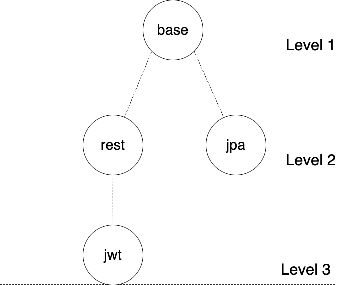

# The Bedrock Pattern

## Introduction
All the time we need to create a new component to our application, we need to define the technologies we need and then setup a scaffolding project in order to start adding the business part to the component.
We usually take some time to get the scaffolding ready all the time we need to start a new component. Let's take a look in the existing patterns to create the scaffolding.

### Existing Patterns
| Pattern | Description | Pros | Cons |
| ------- | ----------- | ---- | ---- |
| Copy Paste | Copy a similar project and start modifying it | <ul><li>Covers code and configuration</li><li>Technology agnostic</li></ul> | <ul><li>Cumbersome to customise (removing all application specific logic)</li><li>No mechanism in place to propagate updates to child projects</li></ul> |
| Maven Archetypes | Create a highly customisable skeleton maven project | <ul><li>Covers code and configuration</li><li>TEasy to customise when extending</li></ul> | <ul><li>Not technology agnostic</li><li>Updates to the template can't be easily adopted in child projects</li></ul> |
| Shared Libraries | Create a base library containing all the department specific logic for services to share | <ul><li>Rolling out updates to existing services is possible</li></ul> | <ul><li>Covers some boilerplate code, but not configuration</li><li>UNot transparent</li></ul> |

## Introducing the Bedrock Pattern
The bedrock pattern conceived by engineers at Kayo Sports (AUS). 
It's based on Linux kernel module development process and leverages Git to create flexible project templates. 
<b>Bedrock</b> terms is being use in geology and describes a bottom rocky layer supporting higher layers of soil. The idea is the same when talking about project templates.

| Pattern | Description | Pros | Cons |
| ------- | ----------- | ---- | ---- |
| Bedrock Pattern | Provide project templates as Git repositories that new projects can pull from | <ul><li>Covers code and configuration in a transparent way</li><li>Easy to customise when extending</li><li>Technology agnostic</li><li>Rolling out updates to existing services is easy</li></ul> | <ul><li>Requires at least intermediate level Git knowledge for all teams</li><li>Requires good design to minimise code conflicts and side effects</li><li>Requires thorough testing to avoid propagating bugs to child projects</li></ul> |

### Example
We can visualise the bedrock pattern by using a tree structure.

- The level 1 or base bedrocks contains an empty project with framework and language details.

- The level 2 bedrocks are extending the base. A level 2 bedrock contains boilerplate code and additional configuration. In our example "jpa" bedrock contains everything from the "base" bedrock and generic code and configuration for an h2 database.

- The level 3 bedrocks are extending one level 2 bedrock. It contains additional boilerplate code and additional configuration on top of the level 2 bedrock. In our example "jwt" bedrock contains everything from the "rest" bedrock and generic code and configuration for jwt authentication for a RESTful application.
